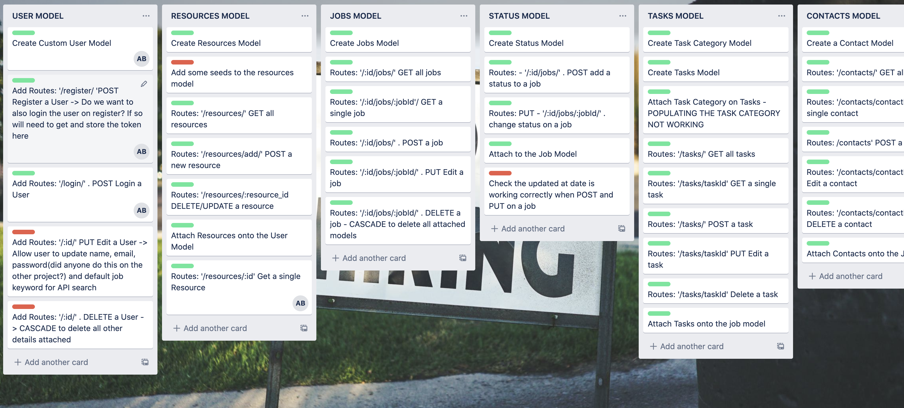

# Project four: JOBR

## Overview

The fourth and final project at General Assembly was to build a full stack application using **Django**, **Python** and **React hooks**. Working in a small group, we created a job application tracker called JOBR, which helps job seekers to organise the roles, tasks, contacts and resources involved in the job search.

The final result can be found at: https://jobeur.herokuapp.com/.

To install and run this app, make sure you have NPM and run `yarn install` to get started!

## Table of contents

* [Brief](#Brief)
* [Build](#Build)
* [Final product](#Final-product)
* [Wins and challenges](#Wins-and-challenges)
* [Bugs](#Bugs)
* [Conclusion](#In-summary)

## Brief

### Technical requirements

* **Build a full stack application** 
* **Use an Python Django API** with a Django REST Framework to serve data from a Postgres database
* **Consume your API with a separate front-end** built with React
* **Be a complete product** which means multiple relationships and CRUD functionality
* **Implement thoughtful user stories/wireframes** 
* **Have a visually impressive design**
* **Be deployed online** and accessible to the public.
* **React Hooks** optional for this project

### Languages and technologies used

* Python
* Django
* Django REST Framework
* React
* Yarn
* Axios
* Semantic UI

## Build 

### Day one

We spent most of the first day planning, wireframing and researching CSS frameworks to use for the project. As with the previous project we used Trello and Miro to help organise ourselves and to come to a consensus on how we wanted to approach development.

### Day two

Given my experience in the previous project where I felt we dedicated too much time to developing the back-end, I pushed to start and finish our back-end for JOBR within one day. And working with a brilliant team, we were able to do it! It took the entire day, but freed us up to do some thorough testing the following morning.

### Day three

We used the entire morning of day three to manually test and troubleshoot the back-end, so we could be confident moving into work on the front-end. That afternoon, we connected both front and back-ends and started putting the application together. I looked after the CRUD functions for jobs, so got to work on those straight away.

As this was the day we started on the front-end this is also when we had a commit to a CSS framework. Having worked extensively with Bulma in previous projects and assignments, we wanted to take on the challenge of working within a new framework. Ultimately, we settled on Semantic UI, as it came with ready-made React component that we could easily import into other components throughout the app.

### Day four through seven

This time was spent predominantly developing the front-end. There were a few occasions where we had to update the back-end based on certain actions and requirements in the front-end, which we were able to do easily.

### Day eight

On the day of submission, we used this time to tidy up the code and double check the design was consistent across the entire application. We were also able to test the front-end and debug code accordingly.

## Final product

### App

As we were nearing the end of the course and starting to think about the job hunt, we thought building an app to better organise our own search would be helpful.

Overview of the app:

* Users must create an account in order to use JOBR
* Once they join, they are able to add roles along with associated tasks and contacts
* Jobs can be organised into five different 'job status' columns: Wishlist, Applied, Interview, Offer and Rejected
* Each column contains a button to add a job. Depending on which one is selected, the new job form will be pre-populated with the respective job status
* JOBR is responsively designed as we anticipated most jobseekers would likely be accessing on their mobile phones
* On desktop, all columns can be viewed and the cards for each role can be moved between columns through HTML5 Drag and Drop functionality
* Jobs only require a job title, company and URL in order to be valid, but can alos hold information like location, application deadline, interview date, notes/description, etc.
* There are 21 categories that tasks can fall into from an initial phone call to sending a thank you letter 
* Contacts only require a name and do not have to be associated with a role within the database. Users can retrospectively update this, but we wanted to add as much flexibility and ease as possible
* JOBR is built almost entirely in React Hooks

## Design

The group quickly came to a consensus of what we wanted for a colour scheme and how that would be incorporated across the site - each column was given a unique colour which was also used in other components. For example, all forms on the tasks page used the same red as the 'Applied' column on the job index page, which was the same red when hovering over the 'Tasks' option in the menu.

### My contribution

I oversaw the job and job status models within the back-end which was a many to one relationship. It made sense to continue working with these on the front end, so I handled most of the CRUD functionality for the jobs on the front-end. My groupmate who was overseeing the job index page implemented the job delete functionality as it sat within that component.

Again with this project, as with the others, I wanted to take a leading orle on the design concept while implementaion was split amonst the group based on which components we were working on. THerefore, I looked after the design of the new job form, the job details card and the job update form.

## Wins and challenges

### Wins

For this project we had the option of working alone or in a group of up to three people. I opted for the latter, working with some of my brilliant classmates, which, to me, was the biggest win. We had such an enjoyable week and were able to learn a lot from each other as we coded and debugged certain components. Because of working in a group, we were able to take on some greater challenges like working with React Hooks and using a new CSS framework: Semantic UI. Both have some serious learning curves, but we were able to support each other, and ultimately produced an app that we're all really proud of.

### Challenges 

As mentioned above, React Hooks and using Semantic UI, a new CSS framework with which we had no experience prior to this project, were the biggest challenges throughout due to their novelty. I can only re-emphasise that working within a group enabled us to understand and correctly implement both of these technologies and come away with a solid portfolio piece.

### Future content

New features would include:

* Allow creation of multiple boards
* Ability to share board(s) with others
* Enable swiping between job status column on mobile and tablet views

## In summary

I loved working on JOBR. It was a great team and we were able to produce a full stack application which we were all extremely proud of.